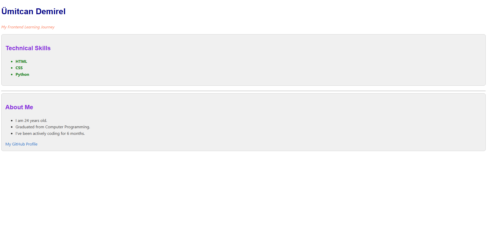

# 01 - Personal Profile Card / Kişisel Profil Kartı

[EN] This project is a professional profile card designed to demonstrate core CSS selectors, semantic HTML5 structure, and clean code principles.
[TR] Bu proje; temel CSS seçicilerini, semantik HTML5 yapısını ve temiz kod prensiplerini sergilemek için tasarlanmış profesyonel bir profil kartıdır.

## 🖼️ Preview / Önizleme

## 🎯 Key Features / Önemli Özellikler

### 🇬🇧 English
* **Semantic HTML5:** Used `<main>`, `<header>`, and `<section>` for better SEO and accessibility.
* **CSS Selectors Mastery:** Implemented ID, Class, Element, and Descendant selectors efficiently.
* **Global Styling:** Managed typography and colors from a central point to follow DRY (Don't Repeat Yourself) principles.
* **Responsive Basics:** Prepared with a viewport meta tag for mobile compatibility.

### 🇹🇷 Türkçe
* **Semantik HTML5:** Daha iyi SEO ve erişilebilirlik için `<main>`, `<header>` ve `<section>` etiketleri kullanıldı.
* **CSS Seçicileri:** ID, Class, Element ve Torun (Descendant) seçicileri verimli bir şekilde uygulandı.
* **Global Stil Yönetimi:** DRY (Kendini Tekrar Etme) prensiplerine uyarak tipografi ve renkler merkezi bir noktadan yönetildi.
* **Mobil Uyumluluk Temelleri:** Mobil cihazlarla uyumluluk için viewport meta etiketi eklendi.

## 🛠️ Technical Stack / Teknolojiler
* **HTML5** (Semantic Structure)
* **CSS3** (Advanced Selectors & Layout)

## 💡 Developer Note / Geliştirici Notu
[EN] In this project, I focused on writing clean, maintainable CSS by grouping selectors and using professional English documentation within the code.
[TR] Bu projede, seçicileri gruplandırarak ve kod içerisinde profesyonel İngilizce dökümantasyon kullanarak temiz ve sürdürülebilir CSS yazmaya odaklandım.