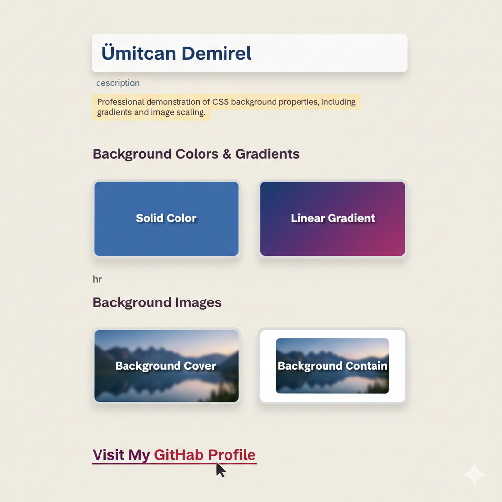

# 03 - CSS Background Mastery / CSS Arka Plan Uzmanlığı

[EN] This project focuses on the versatile use of CSS background properties, covering everything from RGBA transparency to modern linear gradients and image scaling techniques.
[TR] Bu proje; RGBA şeffaflığından modern lineer gradyanlara ve görsel ölçeklendirme tekniklerine kadar CSS arka plan özelliklerinin çok yönlü kullanımına odaklanmaktadır.

## 🖼️ Preview / Önizleme

## 🎯 Key Features / Önemli Özellikler

### 🇬🇧 English
* **Alpha Channel Transparency:** Used `rgba()` to create readable text overlays on top of backgrounds.
* **Gradient Mastery:** Implemented modern `linear-gradient` backgrounds for a dynamic UI.
* **Background Scaling:** Demonstrated the critical difference between `background-size: cover` and `contain`.
* **Visual Polish:** Added `box-shadow` and `border-radius` to create modern, card-like UI components.

### 🇹🇷 Türkçe
* **Alpha Kanalı Şeffaflığı:** Arka planlar üzerinde okunabilir metin katmanları oluşturmak için `rgba()` kullanıldı.
* **Gradyan Uzmanlığı:** Dinamik bir kullanıcı arayüzü için modern `linear-gradient` arka planlar uygulandı.
* **Arka Plan Ölçeklendirme:** `background-size: cover` ve `contain` arasındaki kritik farklar sergilendi.
* **Görsel Rötuşlar:** Modern, kart yapısında arayüz bileşenleri oluşturmak için `box-shadow` ve `border-radius` eklendi.

## 🛠️ Technical Stack / Teknolojiler
* **HTML5** (Semantics & Layout)
* **CSS3** (Gradients, Scaling, Positioning, Shadows)

## 💡 Developer Note / Geliştirici Notu
[EN] In this lab, I mastered how to handle background images without distortion and how to use gradients to replace heavy image assets, improving page performance.
[TR] Bu laboratuvar çalışmasında, arka plan görsellerini bozulmadan yönetmeyi ve sayfa performansını artırmak için ağır görsel dosyaları yerine gradyanları nasıl kullanacağımı öğrendim.