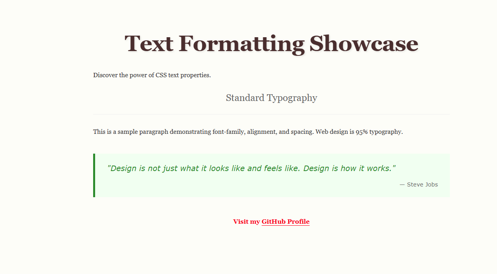

# 05 - Text Formatting Showcase / Metin Biçimlendirme Sergisi

[EN] This project serves as a comprehensive gallery of CSS text properties, demonstrating how typography impacts visual hierarchy and user experience on the web.
[TR] Bu proje; tipografinin görsel hiyerarşi ve kullanıcı deneyimi üzerindeki etkisini gösteren, CSS metin özelliklerinin kapsamlı bir galerisidir.

## 🖼️ Preview / Önizleme

## 🎯 Key Features / Önemli Özellikler

### 🇬🇧 English
* **Typographic Hierarchy:** Used font sizes, weights, and `text-transform` to create a clear reading path.
* **Modern Readability:** Applied `line-height` (leading) and `letter-spacing` (tracking) for optimal legibility.
* **Specialized Formatting:** Styled `blockquote` and `cite` elements to create distinct, high-impact pull quotes.
* **Advanced Decoration:** Utilized `text-underline-offset` and `text-shadow` for professional aesthetic touches.

### 🇹🇷 Türkçe
* **Tipografik Hiyerarşi:** Net bir okuma yolu oluşturmak için font boyutları, ağırlıkları ve `text-transform` kullanıldı.
* **Modern Okunabilirlik:** Optimum okunabilirlik için `line-height` ve `letter-spacing` uygulandı.
* **Özelleştirilmiş Biçimlendirme:** Etkileyici alıntılar oluşturmak için `blockquote` ve `cite` öğeleri stilize edildi.
* **Gelişmiş Süsleme:** Profesyonel estetik dokunuşlar için `text-underline-offset` ve `text-shadow` kullanıldı.

## 🛠️ Technical Stack / Teknolojiler
* **HTML5** (Semantics & Text Elements)
* **CSS3** (Typography, Spacing, Text Effects)

## 💡 Developer Note / Geliştirici Notu
[EN] "Web design is 95% typography." In this lab, I focused on fine-tuning the space between characters and lines to turn raw text into a professional interface.
[TR] "Web tasarımı %95 tipografidir." Bu laboratuvarda, ham metni profesyonel bir arayüze dönüştürmek için karakterler ve satırlar arasındaki boşlukları optimize etmeye odaklandım.