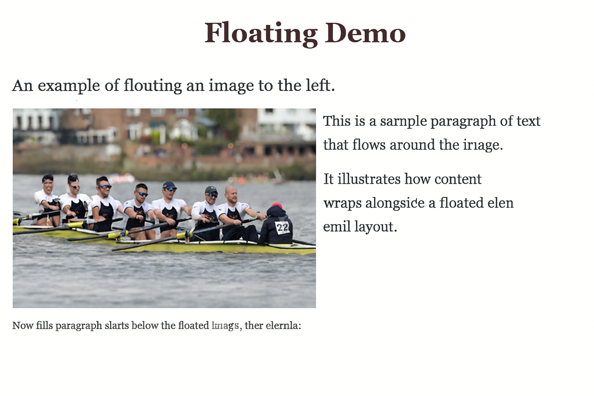

# 06-Floating Demo

## 🇹🇷 Türkçe Açıklama

Bu mini proje, CSS ile görselin sola yaslanması (float) ve metnin etrafına sarılması (text wrapping) konularını göstermektedir.  
Ayrıca `clear: both;` kullanılarak görselin altından başlayan yeni bir paragraf örneği sunulmuştur.

### Kullanılan Özellikler
- **float: left** → Görseli sola yaslama  
- **margin-right** → Görsel ile metin arasında boşluk bırakma  
- **text wrapping** → Metnin görselin etrafına sarılması  
- **clear: both** → Yeni paragrafın görselin altından başlamasını sağlama  
- **font-family** → Serif font kullanımı  
- **background-color** → Açık krem arka plan  
- **responsive layout** → Görsel boyutu ve hizalama dengesi  

---

## 🇬🇧 English Description

This mini project demonstrates how to float an image to the left using CSS and wrap text around it.  
It also includes a paragraph that starts below the floated image using `clear: both;`.

### Applied Features
- **float: left** → Aligning the image to the left  
- **margin-right** → Adding space between image and text  
- **text wrapping** → Wrapping text around the floated image  
- **clear: both** → Starting a new paragraph below the floated image  
- **font-family** → Using serif fonts  
- **background-color** → Off-white background  
- **responsive layout** → Balanced image size and alignment  

---

## 📂 Project Files

- [index.html](./index.html)  
- [style.css](./style.css)  
- [README.md](./README.md)  
- [floating-demo.png](./floating-demo.png)

---

## 📂 Project Structure
```
CSS-MiniProjects/
└── 06-floating-demo/
├── index.html
├── style.css
├── README.md
└── floating-demo.png
```

---

## 📸 Screenshot


