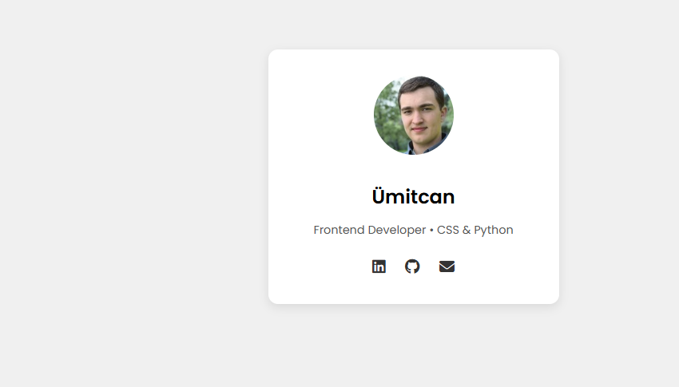

# Fonts & Icons Demo

## 🇹🇷 Türkçe Açıklama

Bu mini proje, **Google Fonts** ve **Font Awesome ikonları** kullanılarak basit bir profil kartı tasarımını göstermektedir.  
Amaç, font entegrasyonu ve ikon kullanımını öğrenmek ve projelerde profesyonel görsellik sağlamaktır.

### Kullanılan Özellikler
- **Google Fonts (Poppins)** → Modern ve okunabilir yazı tipi  
- **Font Awesome ikonları** → LinkedIn, GitHub ve e‑posta ikonları  
- **Profil kartı tasarımı** → Fotoğraf, isim, açıklama ve sosyal medya bağlantıları  
- **box-shadow & border-radius** → Kartın görsel olarak öne çıkması  
- **em & rem kullanımı** → Responsive ve esnek font boyutları  

---

## 🇬🇧 English Description

This mini project demonstrates a simple **profile card design** using **Google Fonts** and **Font Awesome icons**.  
The goal is to practice font integration and icon usage while creating a clean, professional UI component.

### Applied Features
- **Google Fonts (Poppins)** → Modern and readable typography  
- **Font Awesome icons** → LinkedIn, GitHub, and email icons  
- **Profile card layout** → Photo, name, description, and social links  
- **box-shadow & border-radius** → Visual enhancement of the card  
- **em & rem units** → Responsive and flexible font sizing  

---

## 📂 Project Files

- [index.html](./index.html)  
- [style.css](./style.css)  
- [README.md](./README.md)  
- [preview.png](./preview.png)  

---

## 📂 Project Structure
```
CSS-MiniProjects/
└── fonts-icons-demo/
├── index.html
├── style.css
├── README.md
└── preview.png
```

---

## 📸 Screenshot


